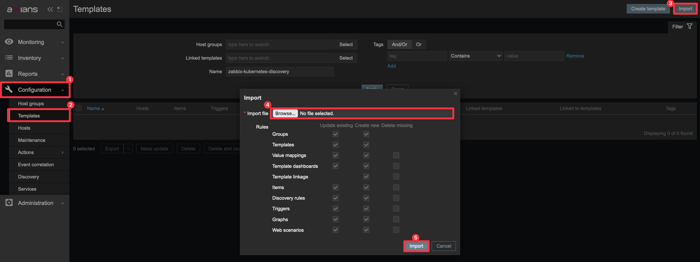

<p align="center">
  <a style="text-decoration:none" href="https://github.com/axians-acsp/zabbix-kubernetes-discovery/blob/main/LICENSE.md">
    
  </a>
  <a style="text-decoration:none" href="https://github.com/axians-acsp/zabbix-kubernetes-discovery/issues">
    
  </a>
  <a style="text-decoration:none" href="https://github.com/axians-acsp/zabbix-kubernetes-discovery/actions/workflows/docker.yml">
    
  </a>
  <a style="text-decoration:none" href="https://github.com/axians-acsp/zabbix-kubernetes-discovery/actions/workflows/helm.yml">
    
  </a>
</p>

# Zabbix Kubernetes Discovery

## Introduction

Kubernetes monitoring for Zabbix with discovery objects:

* Nodes
* DaemonSets
* Deployments
* PersistentVolumeClaims

Works with 2 variables only by default:

* `ZABBIX_ENDPOINT`: Zabbix server/proxy where the datas will be sent
* `KUBERNETES_NAME`: Name of your Kubernetes cluster on Zabbix (host)

## Helm

Before installation, you need to create `zabbix-monitoring` namespace in your cluster:

```bash
$ kubectl create namespace zabbix-monitoring
```

### Install from local

```bash
$ helm upgrade --install zabbix-kubernetes-discovery \
    ./helm/zabbix-kubernetes-discovery/ \
    --values ./helm/zabbix-kubernetes-discovery/values.yaml \
    --namespace zabbix-monitoring \
    --set namespace.name="zabbix-monitoring" \
    --set environment.ZABBIX_ENDPOINT="zabbix-proxy.example.com" \
    --set environment.KUBERNETES_NAME="kubernetes-cluster-example"
```

### Install from repo

```bash
$ helm repo add acsp https://helm.acsp.io
$ helm upgrade --install zabbix-kubernetes-discovery \
    acsp/zabbix-kubernetes-discovery \
    --namespace zabbix-monitoring
    --set namespace.name="zabbix-monitoring" \
    --set environment.ZABBIX_ENDPOINT="zabbix-proxy.example.com" \
    --set environment.KUBERNETES_NAME="kubernetes-cluster-name"
```

## Zabbix

### Import template

Zabbix template is located in [`./zabbix/`](./zabbix/) folder on this repository.

After downloading, you need to import it as below:

1. Go to **Configuration** in menu
2. And **Templates**
3. Click **Import**
4. Select downloaded template file
5. Confirm import



### Discovery rules

* Daemonset
  * Items: 4
    * `Daemonset {#KUBERNETES_DAEMONSET_NAME}: Available replicas`
    * `Daemonset {#KUBERNETES_DAEMONSET_NAME}: Current replicas`
    * `Daemonset {#KUBERNETES_DAEMONSET_NAME}: Desired replicas`
    * `Daemonset {#KUBERNETES_DAEMONSET_NAME}: Ready replicas`
  * Triggers: 4
    * `Daemonset {#KUBERNETES_DAEMONSET_NAME}: Available replicas nodata`
    * `Daemonset {#KUBERNETES_DAEMONSET_NAME}: Current replicas nodata`
    * `Daemonset {#KUBERNETES_DAEMONSET_NAME}: Desired replicas nodata`
    * `Daemonset {#KUBERNETES_DAEMONSET_NAME}: Ready replicas nodata`
  * Graphs: 1
    * `Daemonset {#KUBERNETES_DAEMONSET_NAME}: Graph replicas`
* Deployment
  * Items: 3
    * `Deployment {#KUBERNETES_DEPLOYMENT_NAME}: Available replicas`
    * `Deployment {#KUBERNETES_DEPLOYMENT_NAME}: Desired replicas`
    * `Deployment {#KUBERNETES_DEPLOYMENT_NAME}: Ready replicas`
  * Triggers: 4
    * `Deployment {#KUBERNETES_DEPLOYMENT_NAME}: Available replicas nodata`
    * `Deployment {#KUBERNETES_DEPLOYMENT_NAME}: Desired replicas nodata`
    * `Deployment {#KUBERNETES_DEPLOYMENT_NAME}: Ready replicas nodata`
    * `Deployment {#KUBERNETES_DEPLOYMENT_NAME}: Problem number of replicas`
  * Graphs: 1
    * `Deployment {#KUBERNETES_DEPLOYMENT_NAME}: Graph replicas`
* Node
  * Items: 7
    * `Node {#KUBERNETES_NODE_NAME}: Allocatable cpu`
    * `Node {#KUBERNETES_NODE_NAME}: Allocatable memory`
    * `Node {#KUBERNETES_NODE_NAME}: Allocatable pods`
    * `Node {#KUBERNETES_NODE_NAME}: Capacity cpu`
    * `Node {#KUBERNETES_NODE_NAME}: Capacity memory`
    * `Node {#KUBERNETES_NODE_NAME}: Capacity pods`
    * `Node {#KUBERNETES_NODE_NAME}: Healthz`
  * Triggers: 2
    * `Node {#KUBERNETES_NODE_NAME}: Health nodata`
    * `Node {#KUBERNETES_NODE_NAME}: Health problem`
  * Graphs: 0
* VolumeClaim
  * Items: 6
    * `Volume {#KUBERNETES_PVC_NAME}: Available bytes`
    * `Volume {#KUBERNETES_PVC_NAME}: Capacity bytes`
    * `Volume {#KUBERNETES_PVC_NAME}: Capacity inodes`
    * `Volume {#KUBERNETES_PVC_NAME}: Free inodes`
    * `Volume {#KUBERNETES_PVC_NAME}: Used bytes`
    * `Volume {#KUBERNETES_PVC_NAME}: Used inodes`
  * Triggers: 10
    * `Volume {#KUBERNETES_PVC_NAME}: Available bytes nodata`
    * `Volume {#KUBERNETES_PVC_NAME}: Capacity bytes nodata`
    * `Volume {#KUBERNETES_PVC_NAME}: Capacity inodes nodata`
    * `Volume {#KUBERNETES_PVC_NAME}: Consumption bytes critical`
    * `Volume {#KUBERNETES_PVC_NAME}: Consumption bytes warning`
    * `Volume {#KUBERNETES_PVC_NAME}: Consumption inodes critical`
    * `Volume {#KUBERNETES_PVC_NAME}: Consumption inodes warning`
    * `Volume {#KUBERNETES_PVC_NAME}: Free inodes nodata`
    * `Volume {#KUBERNETES_PVC_NAME}: Used bytes nodata`
    * `Volume {#KUBERNETES_PVC_NAME}: Used inodes nodata`
  * Graphs: 2
    * `Volume {#KUBERNETES_PVC_NAME}: Graph bytes`
    * `Volume {#KUBERNETES_PVC_NAME}: Graph inodes`

## Development

### Manual build

You can build Docker image manually like this:

```bash
$ docker build -t zabbix-kubernetes-discovery .
```

## Contributing

All contributions are welcome! Please fork the main branch, create a new branch and then create a pull request.
